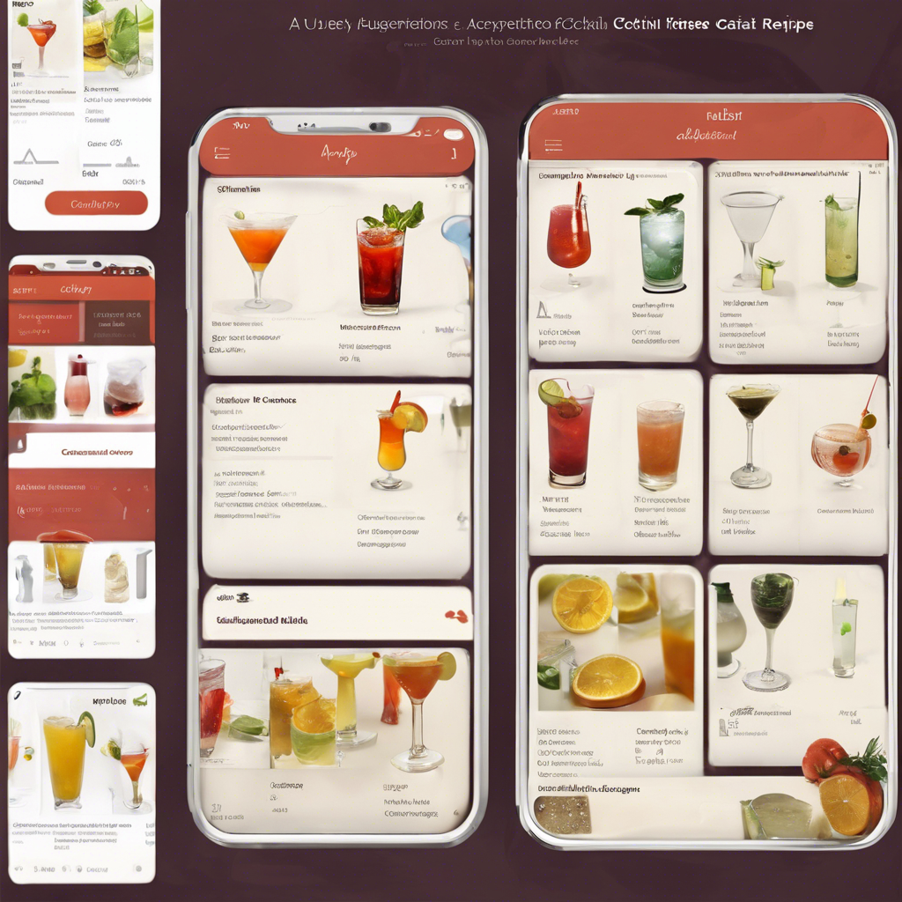

# 수도권 ICT 올인원 Pass! 인공지능 프로젝트 마스터 2,3기
* KICT 프로젝트반

	파이썬@ 
	   <a href='https://www.facebook.com/dongjo.lim.7'>LDJ</a>
	, [임동조](colabstart@gmail.com)

<h2><b> 프로젝트 정리 </b></h2>

## Notice for Team Project

최종 프로젝트 진행
* 기간 : 2024.08.12(월) ~ 2024.10.26(토)  

## Reference Documents

### 문서초안-세부 사항은 변경될 수 있음.
- Proj-01. [포트폴리오 자료      ][proj-01]
- Proj-02. [프로젝트 결과보고서 포맷   ][proj-02]

[proj-01]:  ./docu/Goorm10_프로젝트보고서_포맷_OOO팀.docx "Go proj-01"
[proj-02]:  ./docu/팀별프로젝트수행_결과작성양식_kdigital.pptx "Go proj-02"

<table border=1 bgcolor="#EEEEEE">
	<tr bgcolor="#CC0000">
		<td width="100">
		
<b>Team Name</b>

		</td>
		<td width="100">
		
<b>Team Building</b>

		</td>
		<td width="300">
		
<b>Project Subject</b>

		</td>
		<td width="150">
		
<b>데이터 URL</b>

		<td width="200">
		
<b>Reports</b>

		</td>
	</tr>
	<tr>
		<td>
		
 닥터아이 </b> 

		</td>
		<td>
			
 이강민(팀장), 김응진, 방찬미, 유혜정 

		</td>
		<td>
			
 방대한 지식 데이터를 LLM 기반 챗봇으로 정보를 제공하는 서비스 

		</td>
		<td>
			
  
			PDF <a href="https://ldjwj.github.io/Goorm_2024_ICT234_allinOne/03_Project_Third/last_reports/Team_PhDi_last_V10.pdf"> 이동 </a>			
			

		</td>
	   <td>
		   
 github  <a href=""> 이동  </a>

			
 notion 기획서 <a href="https://billowy-clover-71f.notion.site/ICT-AI-Main-Project-10aa47fb178c8039b76dc16583e5e02d"> 이동하기 </a> 

		</td>
	</tr>
	<tr>
		<td>
			
 금쪽이들 </b> 

	    </td>
		<td>
		    
 최산(팀장), 정문경(부팀장), 김규진, 박규리 

		</td>
		<td>
			
 닥터오의 금쪽상담 

		</td>
		<td>
			
  
			PDF <a href="https://ldjwj.github.io/Goorm_2024_ICT234_allinOne/03_Project_Third/last_reports/Team_Droh_last_V10.pdf"> 이동 </a>			
			

		</td>
	   <td>
		   
 github  <a href=""> 이동  </a>

			
 

		</td>
	</tr>
	<tr>
		<td>
		
 헬스메이트 </b> 

		</td>
		<td>
			
 강성일(팀장), 윤서현, 이재만, 최영아, 최원미 

		</td>
		<td>
			
 만성질환 건강정보 제공 챗봇 

		</td>
		<td>
			
  
			PDF <a href="https://ldjwj.github.io/Goorm_2024_ICT234_allinOne/03_Project_Third/last_reports/Team_Healthmate_last_V10.pdf"> 이동 </a>			
			

		</td>
	   <td>
		   
 github  <a href=""> 이동  </a>

			
 notion 기획서 
			<a href="https://super-gourd-bf0.notion.site/QA-114aa38ed1be803da741c9a20c8ab1ff"> 웹(WEB) </a> 
			<a href="https://ldjwj.github.io/Goorm_2024_ICT234_allinOne/03_Project_Third/last_notion/Team_Healthmate_notion_last_V10.pdf"> PDF </a> 
			

		</td>
	</tr>
	<tr>
		<td>
		
 snapx </b> 

		</td>
		<td>
			
 정도영(팀장), 신민철 

		</td>
		<td>
			
 우리 동네 믹솔로지스트   위스키 레시피 서비스  

		</td>
		<td>
			
  
			PDF <a href="https://ldjwj.github.io/Goorm_2024_ICT234_allinOne/03_Project_Third/last_reports/Team_snapx_last_V10.pdf"> 이동 </a>			
			

		</td>
	   <td>
		   
 web ppt  
		   <a href="https://www.canva.com/design/DAGUmWTdM-A/UeOpN5jt3tyz5CwcxkEJEw/view?utm_content=DAGUmWTdM-A&utm_campaign=designshare&utm_medium=link&utm_source=editor#1"> 이동  </a>
		   

		   
 스마트폰 동영상
		   <a href="https://drive.google.com/file/d/1hapz5XCb3wu0k2QWxJStrX6434PQfg0g/view?usp=sharing"> 이동 </a>
		   

			
 notion 기획서 
			<a href="https://outgoing-beast-a3b.notion.site/Neighborhood-Mixologist-1198bc5b0f4c8088bc8ac17cd3a909a6"> 웹(WEB) </a> 
			<a href="https://ldjwj.github.io/Goorm_2024_ICT23_allinOne/03_Project_Third/last_notion/Team_snapx_notion_last_V10.pdf"> PDF </a> 
			

		</td>
	<tr>
		<td>
		
 문서대장간 </b> 

		</td>
		<td>
			
 배소정(전 팀장 류동경), 변진애

		</td>
		<td>
			
 판결 솔루션   상황맞춤 이혼 판결문 생성 서비스 

		</td>
		<td>
			
  
			PDF <a href="https://ldjwj.github.io/Goorm_2024_ICT234_allinOne/03_Project_Third/last_reports/Team_DocForge_last_V10.pdf"> 이동 </a>			
			

		</td>
	   <td>
		   
 github  <a href=""> 이동  </a>

			
 notion 기획서 <a href="https://jasper-hubcap-479.notion.site/RAG-112089929b31808ab5defa9ca8965419?pvs=4"> 이동하기 </a> 

		</td>
	</tr>
	<tr>
		<td>
		
 지켜보고있다 </b> 

		</td>
		<td>
			
 장지연(팀장), 김민정

		</td>
		<td>
			
 얼굴 인식을 통한 보안 알림 시스템 

		</td>
		<td>
			
  
			PDF <a href="https://ldjwj.github.io/Goorm_2024_ICT234_allinOne/03_Project_Third/last_reports/Team_DocForge_last_V10.pdf"> 이동 </a>			
			

		</td>
	   <td>
		   
 github  <a href="https://github.com/jigosu/CCTV"> 이동  </a>

			
 notion 기획서 <a href="https://nebula-seat-dfb.notion.site/118fda6aad328091af78c3846c2266c5"> 이동하기 </a> 

		</td>
	</tr>
	<tr>
		<td>
		
 pAlk 주부 </b> 

		</td>
		<td>
			
 맹인호(팀장), 백송이, 허경, 하재환

		</td>
		<td>
			
 pAlk 주부 요리 비서 

		</td>
		<td>
			
  
			PDF <a href="https://ldjwj.github.io/Goorm_2024_ICT234_allinOne/03_Project_Third/last_reports/team_pAlk_last_V10.pdf"> 이동 </a>			
			

		</td>
	   <td>
		   
 github  <a href="https://github.com/jigosu/CCTV"> 이동  </a>

			
 notion 기획서 <a href="https://mino0121.notion.site/112cad743d42807d8108da3e2f29b8cc"> 이동하기 </a> 

		</td>
	</tr>
	<tr>
		<td>
		
 일당삼  </b> 

		</td>
		<td>
			
 최태환(팀장) 

		</td>
		<td>
			
 Smart Throw 

		</td>
		<td>
			
  
			데이터로 <a href="https://dacon.io/competitions/open/235536/data"> 이동 </a>			
			

		</td>
	   <td>
		   
 github   이동 

			
 notion 기획서 <a href="https://mino0121.notion.site/112cad743d42807d8108da3e2f29b8cc"> 이동하기 </a> 

		</td>
	</tr>
	<tr>
		<td>
		
 DishFinder </b> 

		</td>
		<td>
			
 [팀장] 김지희, 강우경, 이영준  

		</td>
		<td>
			
 연예인 맛집 추천 서비스 

		</td>
		<td>
			
  
			데이터로 <a href="http://opendata.hira.or.kr/op/opc/olapMsupInfo.do"> 이동 </a>			
			

		</td>
	   <td>
		   
 github  이동 

			
 notion 기획서  이동하기 

		</td>
	</tr>
</table>

 

 &lt; The End &gt; 

