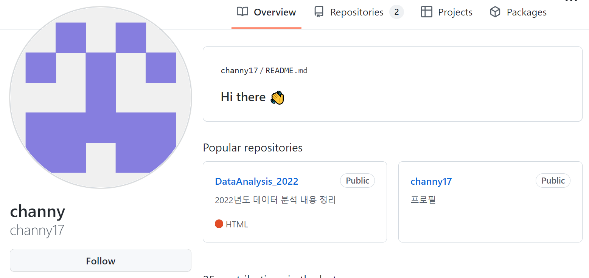

# 수도권 ICT 올인원 Pass! 인공지능 프로젝트 마스터 2,3기
* KICT 프로젝트반

	파이썬@ 
	   <a href='https://www.facebook.com/dongjo.lim.7'>LDJ</a>
	, [임동조](colabstart@gmail.com)

<h2><b> 프로젝트 정리 </b></h2>

## Notice for Team Project

최종 프로젝트 진행
* 기간 : 2024.08.12(월) ~ 2024.10.26(토)  

## Reference Documents

### 문서초안-세부 사항은 변경될 수 있음.
- Proj-01. [포트폴리오 자료      ][proj-01]
- Proj-02. [프로젝트 결과보고서 포맷   ][proj-02]

[proj-01]:  ./docu/Goorm10_프로젝트보고서_포맷_OOO팀.docx "Go proj-01"
[proj-02]:  ./docu/팀별프로젝트수행_결과작성양식_kdigital.pptx "Go proj-02"

<table border=1 bgcolor="#EEEEEE">
	<tr bgcolor="#CC0000">
		<td width="100">
		
<b>Team Name</b>

		</td>
		<td width="100">
		
<b>Team Building</b>

		</td>
		<td width="300">
		
<b>Project Subject</b>

		</td>
		<td width="150">
		
<b>데이터 URL</b>

		<td width="200">
		
<b>Reports</b>

		</td>
	</tr>
	<tr>
		<td>
		
 닥터아이 </b> 

		</td>
		<td>
			
 [팀장] 이강민, 김응진, 방찬미, 유혜정 

		</td>
		<td>
			
 방대한 지식 데이터를 LLM 기반 챗봇으로 정보를 제공하는 서비스 

		</td>
		<td>
			
  
			PDF <a href="./last_reports/Team_PhDi_last_V10.pdf"> 이동 </a>			
			

		</td>
	   <td>
		   
 github  <a href="https://github.com/jogibbeum"> 이동  </a>

			
 notion <a href=""> 이동하기 </a> 

		</td>
	</tr>
	<tr>
		<td>
		
 문서대장간 </b> 

		</td>
		<td>
			
 [팀장] 배소정(전 팀장 류동경), 변진애

		</td>
		<td>
			
 이혼 판결문 생성 서비스 

		</td>
		<td>
			
  
			자료(PDF) <a href="https://www.kaggle.com/datasets/jillanisofttech/brain-stroke-dataset"> 이동 </a>			
			

		</td>
	<td>
		
 github로  <a href="https://github.com/channy17"> 이동  </a>

			
 나의 분석 발걸음 <a href="https://github.com/channy17/DataAnalysis_2022"> github </a>or notion

		</td>
	</tr>
	<tr>
		<td>
		
 일당삼  </b> 

		</td>
		<td>
			
 [팀장] 최태환 

		</td>
		<td>
			
 Smart Throw 

		</td>
		<td>
			
  
			데이터로 <a href="https://dacon.io/competitions/open/235536/data"> 이동 </a>			
			

		</td>
	<td>
		
 github로  <a href="https://github.com/yeonu9"> 이동  </a>

			
 나의 분석 발걸음 <a href="https://github.com/yeonu9/MyDataAnalysis_2022"> github </a> or notion

		</td>
	</tr>
	<tr>
		<td>
		
 금쪽이들 </b> 

		</td>
		<td>
			
 [팀장] 최산, 정문경(부팀장), 김규진, 박규리 

		</td>
		<td>
			
 닥터오의 금쪽상담 

		</td>
		<td>
			
  
			데이터로 <a href="./last_reports/Team_DrOh_last.pdf"> 이동 </a>			
			

		</td>
		<td>
			
  
			자료(PDF) <a href="https://www.kaggle.com/datasets/arianazmoudeh/airbnbopendata"> 이동 </a>			
			

		</td>
	<td>
	<tr>
		<td>
		
 헬스메이트 </b> 

		</td>
		<td>
			
 [팀장] 강성일, 윤서현, 이재만, 최영아, 최원미 

		</td>
		<td>
			
 만성질환 건강정보 제공 챗봇 

		</td>
		<td>
			
  
			데이터로 <a href="https://www.kaggle.com/datasets/arianazmoudeh/airbnbopendata"> 이동 </a>			
			

		</td>
	<td>
		
 github로  <a href="https://github.com/bestofGE"> 이동  </a>

			
 나의 분석 발걸음 <a href="https://bestofge.github.io/MyDataAnalysis/"> github </a> or notion

		</td>
	</tr>
	<tr>
		<td>
		
 지켜보고있다 </b> 

		</td>
		<td>
			
 [팀장] 장지연, 김민정

		</td>
		<td>
			
 얼굴 인식을 통한 보안 알림 시스템 

		</td>
		<td>
			
  
			데이터로 <a href="https://www.kaggle.com/datasets/jboysen/mri-and-alzheimers"> 이동 </a>			
			

		</td>
	<td>
	<tr>
		<td>
		
 DishFinder </b> 

		</td>
		<td>
			
 [팀장] 김지희, 강우경, 이영준  

		</td>
		<td>
			
 연예인 맛집 추천 서비스 

		</td>
		<td>
			
  
			데이터로 <a href="http://opendata.hira.or.kr/op/opc/olapMsupInfo.do"> 이동 </a>			
			

		</td>
	<td>
		
 github로  <a href="https://github.com/juheefatal"> 이동  </a>

			
 나의 분석 발걸음 <a href="https://github.com/juheefatal/MyDataAnalysis"> github </a> or notion

		</td>
	</tr>
	<tr>
		<td>
		
 pAlk 주부 </b> 

		</td>
		<td>
			
 [팀장] 맹인호, 백송이, 허경, 하재환

		</td>
		<td>
			
 레시피 추천 챗봇 서비스 

		</td>
		<td>
			
  
			데이터로 <a href="https://www.kaggle.com/datasets/omkargowda/football-players-stats-premier-league-20212022"> 이동 </a>			
			

		</td>
	<td>
		
 github로  <a href="https://github.com/jus9298"> 이동  </a>

			
 나의 분석 발걸음 <a href="https://github.com/jus9298/football"> github </a> or notion

		</td>
	</tr>
	<tr>
		<td>
		
 홀로YOLO </b> 

		</td>
		<td>
			
 [팀장] 노승일 

		</td>
		<td>
			
 데이터품질 점검 및 객체탐지 모델 시스템 

		</td>
		<td>
			
  
			데이터로 <a href="https://www.kaggle.com/datasets/fedesoriano/stroke-prediction-dataset?select=healthcare-dataset-stroke-data.csv"> 이동 </a>			
			

		</td>
	<td>
		
 github로  <a href="https://github.com/porrima53"> 이동  </a>

			
 나의 분석 발걸음 <a href="https://github.com/porrima53/my_data_analysis"> github </a> or notion

		</td>
	</tr>
	<tr>
		<td>
		
 snapx </b> 

		</td>
		<td>
			
 [팀장] 정도영, 신민철 

		</td>
		<td>
			
 위스키 레시피 추천 챗봇 서비스  

		</td>
		<td>
			
  
			데이터로 <a href="https://dacon.io/competitions/official/235959/overview/description"> 이동 </a>			
			

		</td>
	<td>
		
 github로  <a href="https://github.com/P-C-Space"> 이동  </a>

			
 나의 분석 발걸음 <a href="https://github.com/P-C-Space/MyDataAnalysis"> github </a> or notion

		</td>
	</tr>
</table>

 

 &lt; The End &gt; 

