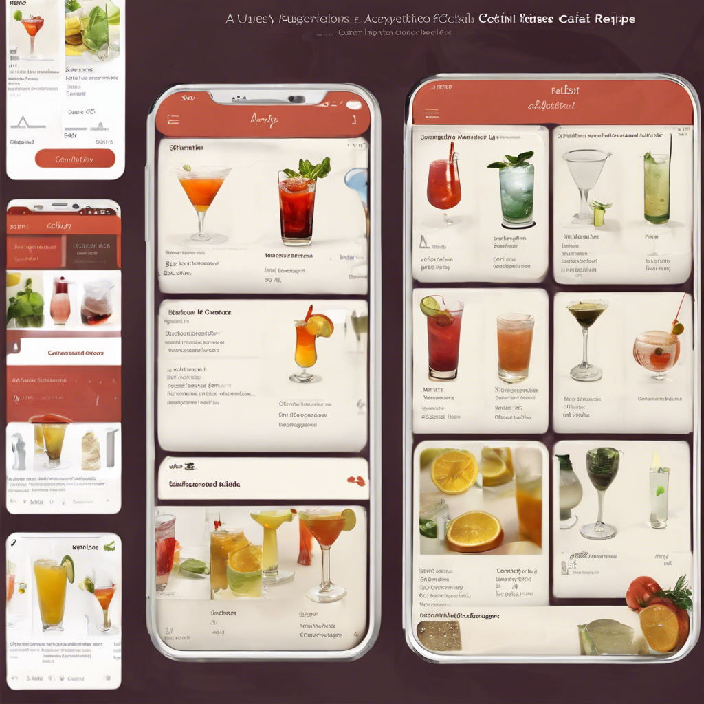

# 수도권 ICT 올인원 Pass! 인공지능 프로젝트 마스터 4기
* KICT 프로젝트반

	파이썬@ 
	   <a href='https://www.facebook.com/dongjo.lim.7'>LDJ</a>
	, [임동조](colabstart@gmail.com)

<h2><b> 프로젝트 정리 </b></h2>

## Notice for Team Project

최종 프로젝트 진행
* 기간 : 2024.10.30(수) ~ 2024.11.29(금)  

## Reference Documents

### 문서초안-세부 사항은 변경될 수 있음.
- Proj-01. [포트폴리오 자료      ][proj-01]
- Proj-02. [프로젝트 결과보고서 포맷   ][proj-02]

[proj-01]:  ./docu/Goorm10_프로젝트보고서_포맷_OOO팀.docx "Go proj-01"
[proj-02]:  ./docu/팀별프로젝트수행_결과작성양식_kdigital.pptx "Go proj-02"

<table border=1 bgcolor="#EEEEEE">
	<tr bgcolor="#CC0000">
		<td width="100">
		
<b>Team Name</b>

		</td>
		<td width="100">
		
<b>Team Building</b>

		</td>
		<td width="300">
		
<b>Project Subject</b>

		</td>
		<td width="150">
		
<b>데이터 URL</b>

		<td width="200">
		
<b>Reports</b>

		</td>
	</tr>
	<tr>
		<td>
		
 뉴런 </b> 

		</td>
		<td>
			
 박양모(팀장), 공하늘, 정지원 

		</td>
		<td>
			
 워드프렌즈(Word Friends), AI 친구와 음성 대화로 영어단어를 배워보는 앱 

		</td>
		<td>
			
  
			PDF <a href="https://ldjwj.github.io/Goorm_2024_ICT234_allinOne\04_Project_Fourth/last_reports/Team_NewLearn_last_V10.pdf"> 이동 </a>			
			

		</td>
	   <td>
		   
 github  <a href=""> 이동  </a>

		   
 notion 기획서 <a href="https://common-soy-74d.notion.site/135fb2cff9d780dda9f1df123b209702?pvs=4"> 이동하기 </a> 

		</td>
	</tr>
	<tr>
		<td>
			
 네모난 상상 </b> 

	    </td>
		<td>
		    
 김영수(팀장), 심혁보, 우정구 

		</td>
		<td>
			
 영단어 챗봇 서비스 

		</td>
		<td>
			
  
			PDF <a href="https://ldjwj.github.io/Goorm_2024_ICT23_allinOne/03_Project_Third/last_reports/Team_네모난상상_last_V10.pdf"> 이동 </a>			
			

		</td>
	   <td>
		   
 github  <a href=""> 이동  </a>

		   
 notion 기획서 <a href="https://charming-surf-7d8.notion.site/Team-Project-13f5165f8bf0800e9b15dbbe0837f925"> 이동하기 </a> 

		   
 

		</td>
	</tr>
	<tr>
		<td>
		
 알파포즈 </b> 

		</td>
		<td>
			
 이로운(팀장), 권지훈, 백다솔, 유영진, 이세준 

		</td>
		<td>
			
 행동과 상황을 인식하고 학습하는 AI 시스템 

		</td>
		<td>
			
  
			PDF <a href="https://ldjwj.github.io/Goorm_2024_ICT23_allinOne/03_Project_Third/last_reports/"> 이동 </a>			
			

		</td>
	   <td>
		   
 github  <a href=""> 이동  </a>

		   
 notion 기획서 <a href="https://common-dinosaur-0d0.notion.site/pose-135d67be8ba480558cbaca134d9dce8d"> 이동하기 </a> 

		   
 

		</td>
	</tr>
	<tr>
		<td>
		
 TADA </b> 

		</td>
		<td>
			
 이규호(팀장), 오동훈 

		</td>
		<td>
			
 데이터분석자동화  

		</td>
		<td>
			
  
			PDF <a href="https://ldjwj.github.io/Goorm_2024_ICT23_allinOne/03_Project_Third/last_reports/"> 이동 </a>			
			

		</td>
	   <td>
		   
 github  <a href=""> 이동  </a>

		   
 notion 기획서 <a href="https://snaiws.notion.site/13de112dcaa580ed812ef01d3e74b890?pvs=4"> 이동하기 </a> 

		   
 

		</td>
	<tr>
		<td>
		
 마음이음 </b> 

		</td>
		<td>
			
 최일락(팀장), 장윤아

		</td>
		<td>
			
 RAG 기반 감정 케어 챗봇 서비스 

		</td>
		<td>
			
  
			PDF <a href="https://ldjwj.github.io/Goorm_2024_ICT23_allinOne/03_Project_Third/last_reports/"> 이동 </a>			
			

		</td>
	   <td>
		   
 github  <a href=""> 이동  </a>

			
 notion 기획서 <a href="https://beryl-phlox-3a4.notion.site/AI-13a7de1677de800bbacde75d1cfe762d?pvs=4"> 이동하기 </a> 

		</td>
	</tr>
	<tr>
		<td>
		
 중식 </b> 

		</td>
		<td>
			
 이중권(팀장), 전재식

		</td>
		<td>
			
 --  

		</td>
		<td>
			
  
			PDF <a href="https://ldjwj.github.io/Goorm_2024_ICT23_allinOne/03_Project_Third/last_reports/"> 이동 </a>			
			

		</td>
	   <td>
		   
 github  <a href=""> 이동  </a>

			
 notion 기획서 <a href="https://www.notion.so/145e21014c0b80e5b15bc02c235701e9?pvs=4"> 이동하기 </a> 

		</td>
	</tr>
	<tr>
		<td>
		
 Momentum </b> 

		</td>
		<td>
			
 이종태(팀장), 최승희 

		</td>
		<td>
			
 암 알아야 산다 

		</td>
		<td>
			
  
			PDF <a href="https://ldjwj.github.io/Goorm_2024_ICT23_allinOne/03_Project_Third/last_reports/"> 이동 </a>			
			

		</td>
	   <td>
		   
 github  <a href=""> 이동  </a>

		   
 notion 기획서 <a href="--"> 이동하기 </a> 

		</td>
	</tr>
</table>

 

 &lt; The End &gt; 

